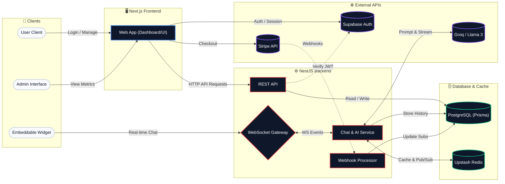
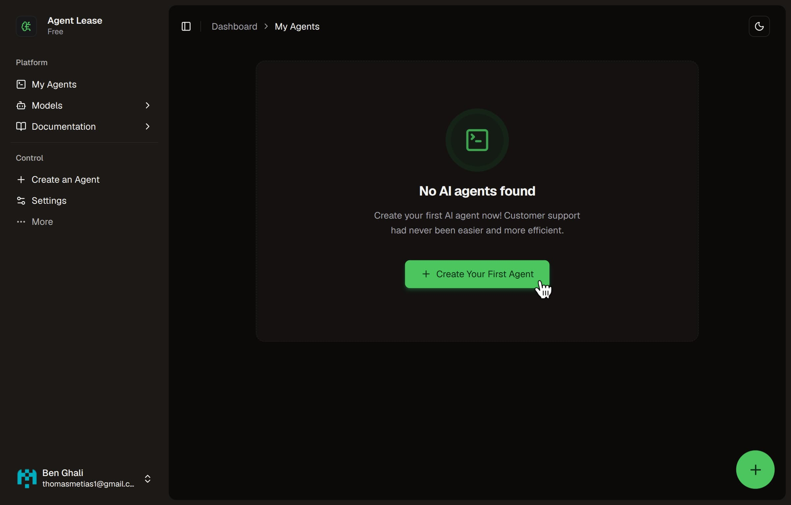
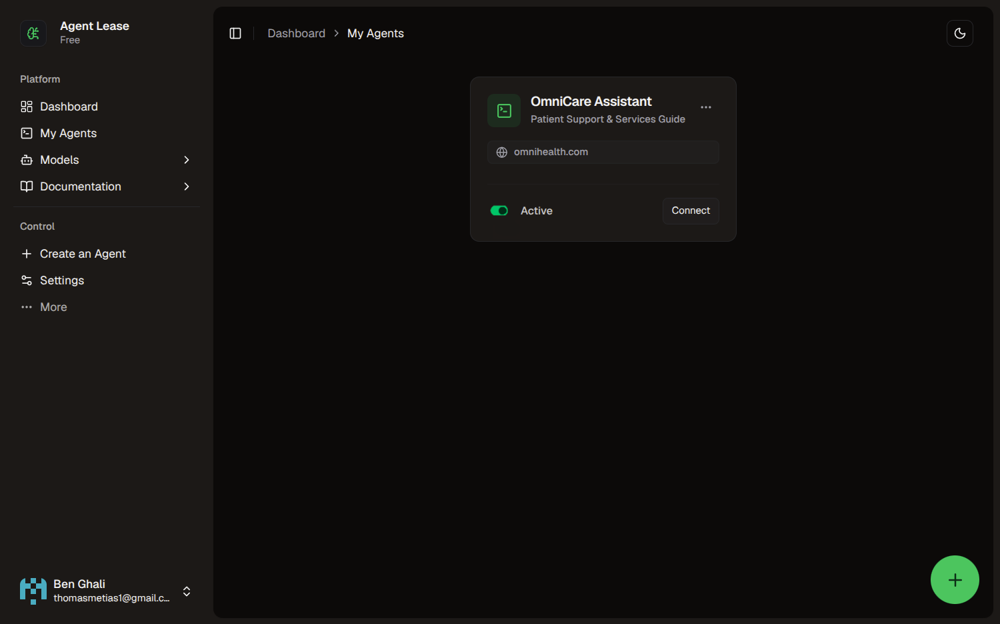

# Agent Lease - Full-Stack AI SaaS Platform

## Video placeholder

**Agent Lease** is a production-ready SaaS platform that allows users to deploy customizable AI chat agents to any website in **under 3 minutes**. It pairs a frictionless, no-code integration widget with a robust, scalable backend—featuring **real-time WebSockets**, **automated Stripe billing**, and **comprehensive usage analytics** for users and **advanced global analytics** for admins.

# [Live Demo ](placeholder-url)

 <!-- Table of Contents reference -->

## Table of Contents placeholder

## Architecture & Data Flow

## Core Features
### 1. Onboarding
Modern sign in/up UI using **Tailwind CSS** & **Shadcn UI**, backed by **Supabase Auth** secure session management.

    
    <small>User Signing up</small>

  <a href="#toc"><b>⤴ Back to Contents</b></a>

### 2. Dashboard
Built using **Shadcn UI + Tailwind CSS** as well.

Once signed in, the user is **redirected to the dashboard** where he can create and manage his AI agents (empty so far, but we'll create one next).

    

    <small>Dashboard > My Agents (empty state)</small>

  <a href="#toc"><b>⤴ Back to Contents</b></a>

### 3. Create Agent
Create & configure a custom AI agent Through a secure form. `zod` validation used to **ensure limits met**.

    
    <small>Creating an agent</small>

> **Notes:**
> - the agent created **only works with the provided domain and no other**; this is a security precaution to prevent being used on other websites without permission from the agent owner (the creator).
> - Form is **secured against DDOS attacks and abuses** using rate limiting.

  <a href="#toc"><b>⤴ Back to Contents</b></a>

### 4. Easy Integration
After creation the user is redirected to a setup page, you can **easily integrate the agent** by following simple instructions given that is customizable to your stack and environment, non-coders can apply this easily from their github by following the guide.

    
    <small>Agent Setup Guide</small>

  <a href="#toc"><b>⤴ Back to Contents</b></a>

## 5. Control Agents behavior
Editing agents configuration can be easily done using the `My Agents` page in your dashboard.

    
    <small>Editing agents configuration</small>

  <a href="#toc"><b>⤴ Back to Contents</b></a>

## 6. Add Agent to your website
Focused on ease of implementation, you only need to copy-paste the script line to you main `.html` file and you'll get your customized agent ready to go instantly!

    
    <small>Adding agent to your website</small>

  <a href="#toc"><b>⤴ Back to Contents</b></a>

