# Agent Lease - Full-Stack AI SaaS Platform
<!-- markdownlint-disable MD033 -->


**Agent Lease** is a production-ready SaaS platform that allows users to deploy customizable AI chat agents to any website in **under 3 minutes**. It pairs a frictionless, no-code integration widget with a robust, scalable backend—featuring **real-time WebSockets**, **automated Stripe billing**, and **comprehensive analytics**. Engineered as a Turborepo monorepo, it demonstrates strict end-to-end type safety, modern infrastructure, and robust enterprise-grade features.

**[🔴 Live Demo](placeholder-url)** | **[▶️ Watch the 90-Second Walkthrough](#video-placeholder)**

> [!IMPORTANT]
> The **Live Demo** is a frontend-only preview. To test the full backend integration too (one-line script implementation, AI streaming, Stripe billing, and analytics), run the ecosystem locally using the [Local Development Guide](#getting-started--local-development).

<a name="toc"></a>

## Table of Contents

- [Agent Lease - Full-Stack AI SaaS Platform](#agent-lease---full-stack-ai-saas-platform)
  - [Table of Contents](#table-of-contents)
  - [Architecture \& Data Flow](#architecture--data-flow)
  - [User Journey Walkthrough](#user-journey-walkthrough)
    - [1. Secure Authentication \& Agent Management](#1-secure-authentication--agent-management)
    - [2. Frictionless Widget Integration](#2-frictionless-widget-integration)
    - [3. Professional, Context-Aware AI Chat](#3-professional-context-aware-ai-chat)
    - [4. Comprehensive User Analytics \& Monetization](#4-comprehensive-user-analytics--monetization)
    - [5. Global Admin Console](#5-global-admin-console)
  - [Engineering \& Infrastructure](#engineering--infrastructure)
  - [Getting Started / Local Development](#getting-started--local-development)
    - [1. Environment Configuration](#1-environment-configuration)
    - [2. Installation \& Database Setup](#2-installation--database-setup)
    - [3. Running the Ecosystem](#3-running-the-ecosystem)
      - [Terminal 1: Start the Turborepo Server](#terminal-1-start-the-turborepo-server)
      - [Terminal 2: Forward Stripe Webhooks](#terminal-2-forward-stripe-webhooks)
  - [License](#license)

## Architecture & Data Flow


## User Journey Walkthrough

### 1. Secure Authentication & Agent Management

A new user's journey begins with a seamless onboarding experience backed by **Supabase Auth** and styled with **Tailwind CSS & Shadcn UI**. After signing in, the user is redirected to their dashboard where they can securely provision and configure a new AI agent. Strict `zod` validation enforces tier-based resource limits from the moment of creation.

<div align="center">
    <br>
    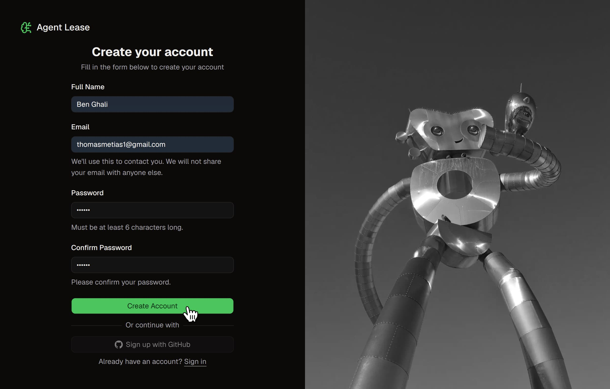
    <br><small><i>1. The user registers for a new account.</i></small>
    <br><br>
    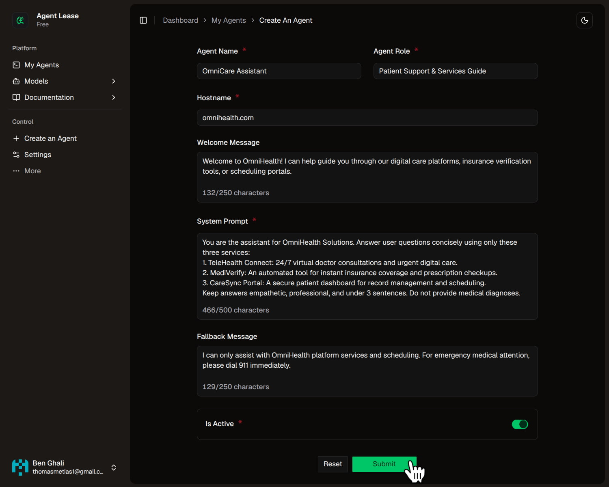
    <br><small><i>2. The user provisions and configures their custom AI agent.</i></small>
    <br><br>
    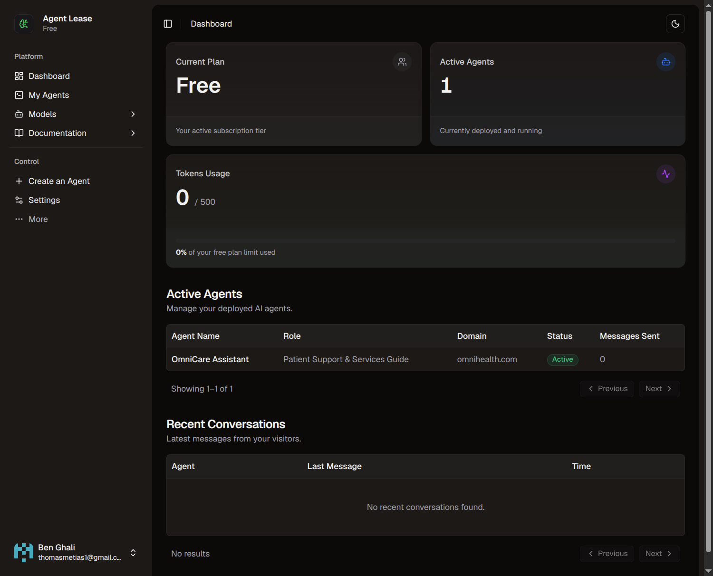
    <br><small><i>3. The user views their dashboard. The agent has been added.</i></small>
</div>

> **Security Note:** Agents are cryptographically bound to specific whitelisted domains to prevent unauthorized cross-site embedding.

<div align="right"><a href="#toc"><b>⤴ Back to Contents</b></a></div>

### 2. Frictionless Widget Integration

Integration is designed for zero friction. Once the agent is provisioned, the user receives framework-agnostic setup instructions. By pasting a single `<script>` tag, they instantly deploy a fully functional, responsive chat bubble to their live website.

<div align="center">
    <br>
    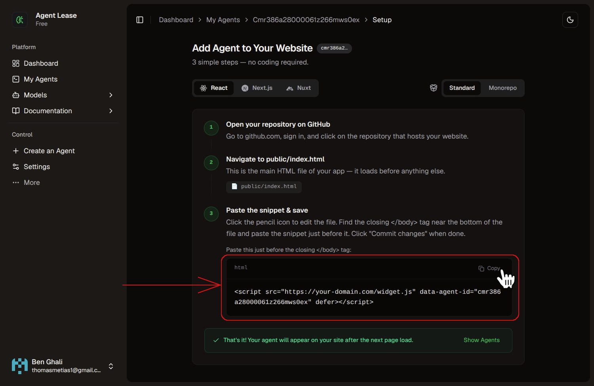
    <br><small><i>4. The user receives a single-line embed script.</i></small>
    <br><br>
    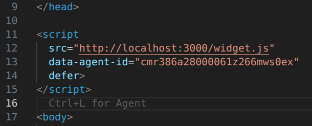
    <br><small><i>5. The user adds the script to their website's HTML.</i></small>
    <br><br>
    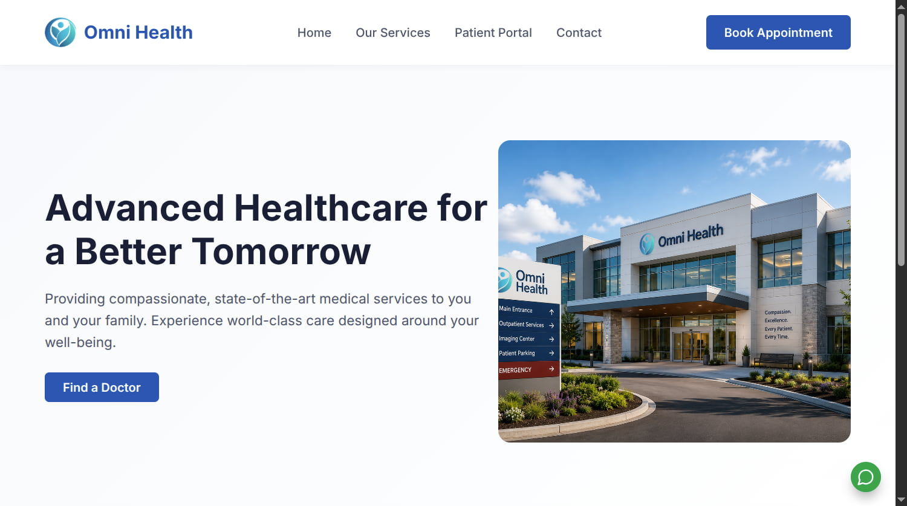
    <br><small><i>6. The live AI chat widget immediately appears on their platform (bottom right).</i></small>
</div>

<div align="right"><a href="#toc"><b>⤴ Back to Contents</b></a></div>

### 3. Professional, Context-Aware AI Chat

As visitors interact with the widget, the conversational engine utilizes **WebSockets** for sub-second streaming. The AI is sandboxed via system prompts to exclusively discuss authorized company data, maintaining a professional tone while strictly refusing unrelated queries.

<div align="center">
    <br>
    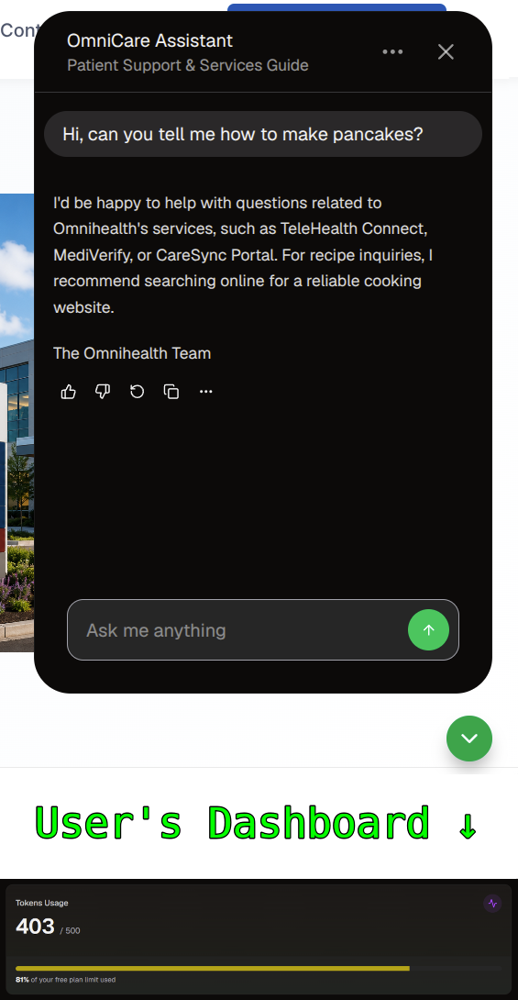
    <br><small><i>7. The AI strictly enforces boundary guardrails on off-topic questions.</i></small><br><small><i>Tokens usage changes are shown in real-time in the user's dashboard.</i></small>
    <br><br>
    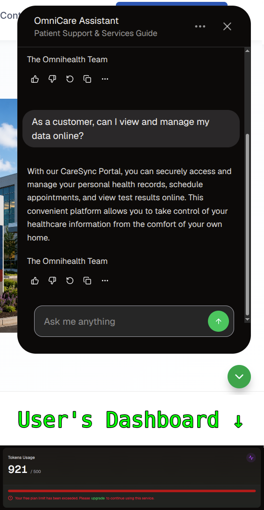
    <br><small><i>8. The AI provides accurate responses for <strong>related questions</strong>.</i></small><br><small><i>Dashboard showing <strong>tokens limit reached</strong> after the last message.</i></small>
    <br><br>
    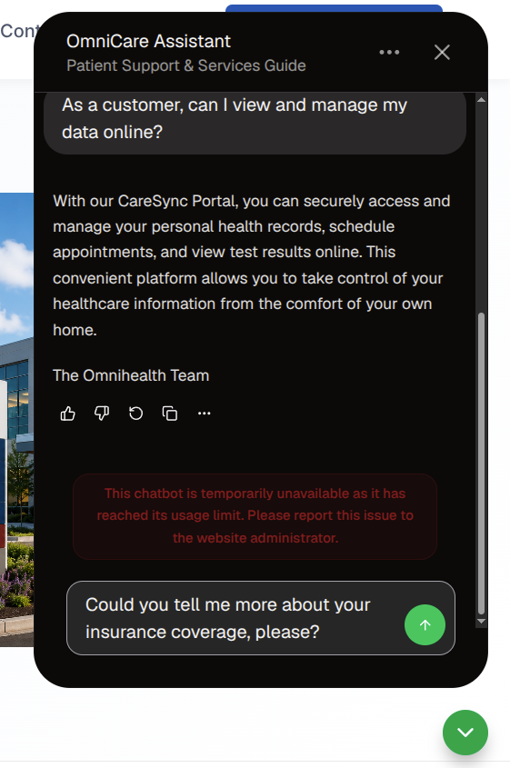
    <br><small><i>9. Usage limits are dynamically enforced for each message.</i></small>
    <br><small><i>Appropriate UI is shown to the user.</i></small>
</div>

> **Infrastructure:** Chats are highly responsive thanks to an **Upstash Redis** caching layer, with asynchronous persistence to **PostgreSQL** for long-term chat transcript review.

<div align="right"><a href="#toc"><b>⤴ Back to Contents</b></a></div>

### 4. Comprehensive User Analytics & Monetization

The user monitors their usage through a dynamic, heavily-cached Next.js dashboard detailing agent performance and token consumption. After eventually exhausting their free quota (as seen in the previous chat), they are seamlessly routed through a **Stripe Checkout** flow to upgrade their subscription tier.

<div align="center">
    <br>
    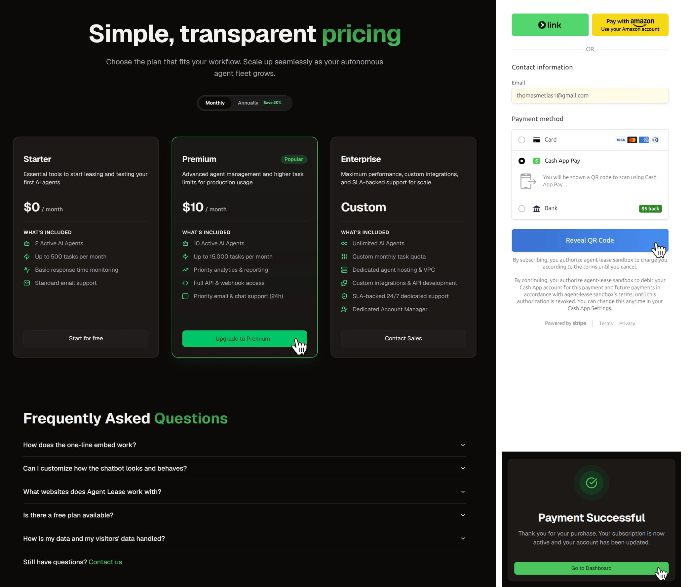
    <br><small><i>10. After hitting their quota, the user upgrades to a Premium plan via a secure Stripe Checkout session.</i></small>
    <br><br>
    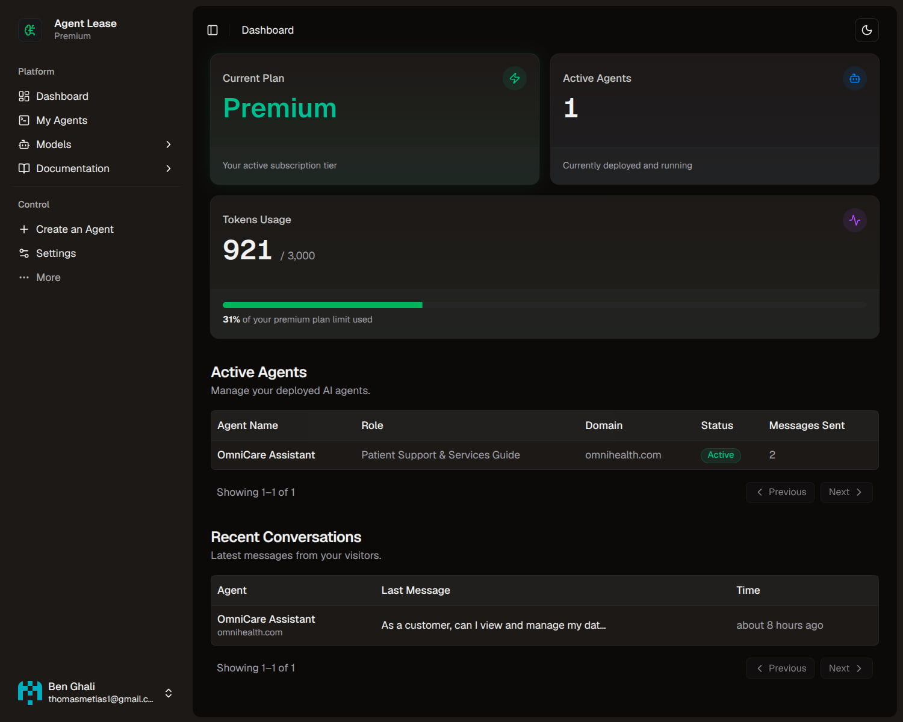
    <br><small><i>11. The dashboard instantly reflects the upgraded plan and massively increased token limits.</i></small>
    <br><small><i>The user can continue the service instantly after the upgrade.</i></small>
</div>

<div align="right"><a href="#toc"><b>⤴ Back to Contents</b></a></div>

### 5. Global Admin Console

Meanwhile, on the backend, platform owners have real-time visibility into critical business metrics. A dedicated admin portal tracks the new active subscription, MRR (Monthly Recurring Revenue), and global token consumption across all user tiers.

<div align="center">
    <br>
    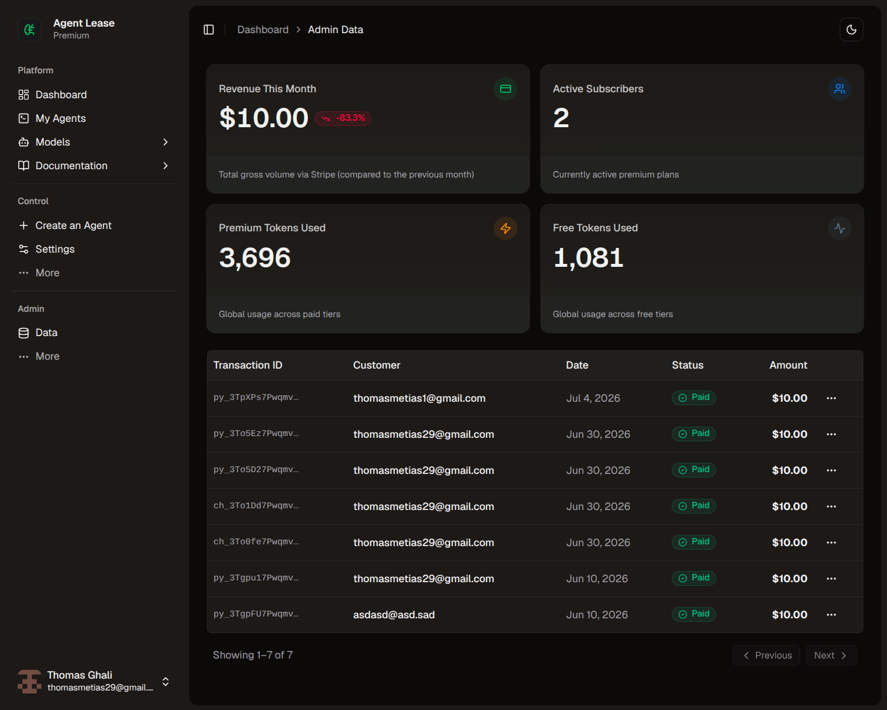
    <br><small><i>12. The admin portal registers the new revenue and subscription metrics in real-time.</i></small>
</div>

<div align="right"><a href="#toc"><b>⤴ Back to Contents</b></a></div>

## Engineering & Infrastructure

While the user journey highlights the frontend capabilities, the backend is engineered for horizontal scalability, data integrity, and strict type safety.

| System                        | Technical Implementation                                                                                                    |
| :---------------------------- | :-------------------------------------------------------------------------------------------------------------------------- |
| **Monorepo Architecture**     | Turborepo workspace managing shared packages and independent builds across Next.js and NestJS.                              |
| **Real-time Infrastructure**  | Scalable WebSocket layer using NestJS gateways, secured by custom JWT authentication guards.                                |
| **Hybrid Data Persistence**   | Upstash Redis for sub-second, ephemeral chat caching and pub/sub, syncing to PostgreSQL for long-term storage.              |
| **End-to-End Type Safety**    | Shared Zod validation schemas enforcing identical data contracts across the frontend UI, API routes, and Prisma ORM models. |
| **Role-Based Access Control** | Supabase Auth integrated with custom backend middleware to strictly separate User and Admin data access.                    |
| **Automated Testing**         | Jest-powered e2e testing infrastructure ensuring core API stability and billing webhook reliability. *(WIP)*                |

---

## Getting Started / Local Development

To run this Turborepo ecosystem locally, ensure you have **Node.js** (v18+), **npm**, and a running **PostgreSQL** instance.

### 1. Environment Configuration

You will need two `.env` files for this project (one at the root and one in the frontend). The easiest way to keep them synchronized is to create the root `.env` and then symlink it to the frontend.

1. Copy the `.env.example` file to `.env` in the root directory:

   ```bash
   cp .env.example .env
   ```

2. Link the root `.env` to the frontend directory (`apps/web`):

   ```bash
   ln -s ../../.env apps/web/.env
   ```

   *(This ensures any changes to one file reflect in the other.)*

You will need to provision and configure keys for the following third-party services:

- **Database**: PostgreSQL connection (`DATABASE_URL`, `DIRECT_URL`)
- **Supabase**: Auth (`NEXT_PUBLIC_SUPABASE_URL`, `NEXT_PUBLIC_SUPABASE_ANON_KEY`, `SUPABASE_SERVICE_ROLE_KEY`).

>***Note**: You must enable the **Email/Password** provider in your Supabase Auth settings.*

- **Stripe**: Billing (`STRIPE_SECRET_KEY`, `WEBHOOK_SECRET_KEY`). You will also need to create two recurring products (Premium and Enterprise) in your Stripe Dashboard, then set their respective Price IDs as `STRIPE_PREMIUM_PRICE_ID` and `STRIPE_ENTERPRISE_PRICE_ID`.
- **Groq**: Llama 3/3.3 API access (`GROQ_API_KEY`)
- **Upstash Redis**: Serverless caching (`UPSTASH_REDIS_REST_URL`, `UPSTASH_REDIS_REST_TOKEN`)

### 2. Installation & Database Setup

Run the following commands from the root workspace:

```bash
# 1. Clone the repository
git clone https://github.com/thomasghali/agent-lease.git
cd agent-lease

# 2. Install dependencies across the monorepo
npm install

# 3. Push the Prisma schema to your PostgreSQL database
npm run db:push
```

### 3. Running the Ecosystem

You need two terminal windows to run the full application locally, including the Stripe webhook listener.

#### Terminal 1: Start the Turborepo Server

```bash
npm run dev
```

*(This starts the Next.js frontend on port 3000, NestJS API on 3001, and WebSocket gateway on 3002).*

#### Terminal 2: Forward Stripe Webhooks

Stripe must be able to hit your local server to process plan upgrades during checkout.

```bash
stripe login
stripe listen --forward-to localhost:3001/webhook
```

*(Copy the generated webhook signing secret into your `.env` as `WEBHOOK_SECRET_KEY` and restart Terminal 1)*

---

## License

**© 2026 Agent Lease. All Rights Reserved.**

This repository and its contents are the proprietary intellectual property of the author.

The source code is published here for portfolio and evaluation purposes only. You are permitted to view, clone, and run this code locally for technical assessment. However, you may not reproduce, distribute, modify, or use this software for any commercial or derivative purposes without explicit written consent.
